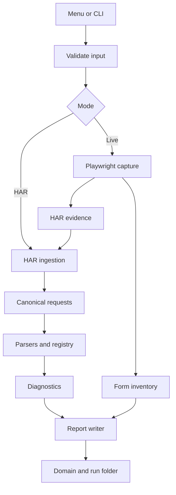

# Architecture

## Principles

- Capture and analysis are separate; the analyser accepts external HARs.
- Inventory is exhaustive; tracking events are derived.
- Vendor parsers are modular; known domains are centralised.
- Safety decisions happen before browser actions.
- Outputs remain traceable to a HAR entry.
- Isolated data failures do not abort safe batch work.

## Data flow



## Recommended modules

```text
src/
  cli.js
  menu.js
  commands/              # one coordinator per mode
  capture/               # browser, page capture, crawler, links, forms, interactions
  input/                 # URL lists and config validation
  har/                   # ingestion, page context, parameter decoding
  classification/
    classify.js
    domain-registry.js
    parsers/              # one focused module per vendor/family
  diagnostics/           # duplicates, sensitive data, missing IDs
  output/                # run manager, CSV, reports, errors, summary
  utils/                 # URLs, paths, redaction
test/
  fixtures/
```

Adapt names to useful existing code, but retain the boundaries.

## Canonical record

Normalise each HAR entry once. Parsers enrich the canonical record rather than filtering/replacing it. Diagnostics append flags. Select the tracking subset only after classification. Keep decoded raw parameters separate from normalised fields and never mutate the original request URL.

## Observation attribution

Capture owns the transition from `page_load` to an interaction name. Store deterministic metadata or a run-local sidecar mapping if HAR cannot represent it. External HARs degrade conservatively.

## Safety boundary

Validate config and resolve environment placeholders before navigation. Authorisation has two layers: static `submissionAllowed` plus run confirmation. The executor still blocks apparent submits when permission is absent.

## Failure model

Expected input/data failures become structured errors. Programmer errors must remain visible to tests. Use narrow per-page/per-HAR boundaries rather than broad catch-all suppression.

## Vendor extension

Add a parser only for known, testable endpoint semantics. Add registry entries for domain/category knowledge. Use low-confidence inference only as the final layer. Every parser needs a synthetic fixture asserting normalised fields and preserved parameters.
